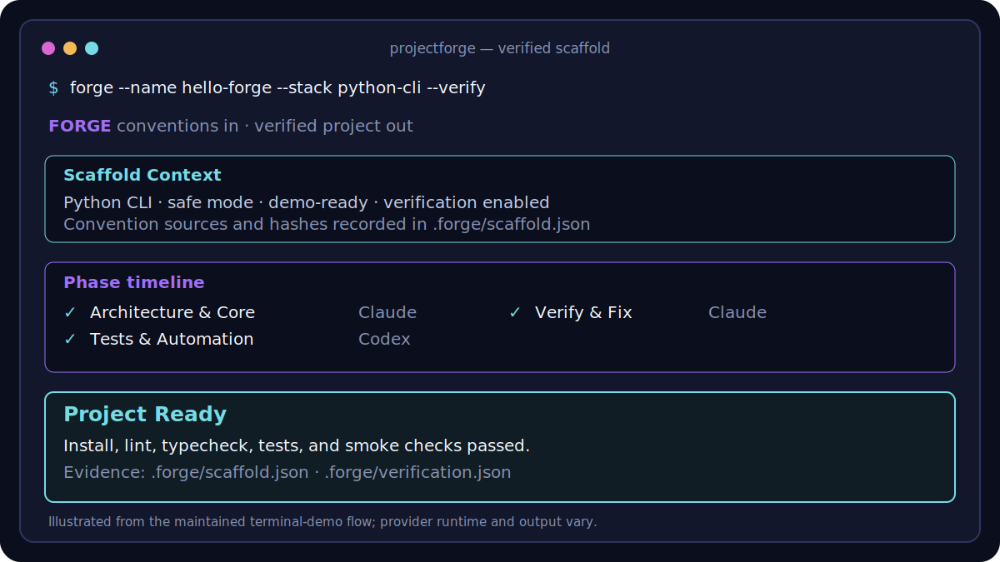

# ProjectForge

Run `projectforge --name atlas --stack fastapi --description "Customer support API" --verify` and get a
working starter repository shaped by your conventions—not just a pile of generated files.
ProjectForge scaffolds Python and TypeScript projects through Claude Code, Google Antigravity CLI,
or Codex CLI, then installs, checks, and verifies the result.

A live scaffold usually takes minutes rather than seconds because providers write code and Forge
runs the generated project's checks. Duration varies by stack and provider; `forge --dry-run`
previews the complete plan instantly and makes no provider call.

The result includes the project, its development commands, and local evidence showing what was
requested, which conventions and providers were used, and whether verification actually passed.




> **Command name:** current source installs `projectforge` as the preferred command and keeps
> `forge` as a compatibility alias. Use `projectforge` if Foundry's Ethereum `forge` is already on
> your PATH; shell command names cannot disambiguate the two tools.

> **Release status:** this README documents ProjectForge v0.7.0. Use the documentation bundled
> with an immutable release for that release's exact behavior.

## What you get

- Interactive and flag-driven scaffolding for seven Python and TypeScript stacks.
- Metadata-aware install, lint, type-check, build, test, and health verification.
- A generated README, development setup, and stack-specific starter structure.
- Zero-provider-call prompt previews with `--dry-run`.
- Failure recovery with `--resume` instead of paying to rerun completed phases.

## Why trust the output

- Forge shows the complete prompt before execution and uses bounded provider workspaces by default.
- `forge doctor` checks installation and authentication without a model call or credential output.
- Provider-default models remain in control unless you deliberately request an override.
- Convention layers are deterministic and recorded with source hashes.
- Blanket provider bypass requires two explicit unsafe flags.
- Atomic progress, failure classification, and resume contracts preserve partial work safely.
- Provider and local-tool failures are converted into bounded, privacy-safe recovery guidance
  instead of echoing untrusted output, stack traces, or machine paths.
- `.forge/` records distinguish “provider finished” from “generated project verified.”

## Supported stacks

| Stack | Identifier | Aliases |
| --- | --- | --- |
| Next.js + React | `nextjs` | `next`, `react` |
| FastAPI | `fastapi` | `api` |
| FastAPI + AI/LLM | `fastapi-ai` | `ai`, `llm` |
| Next.js + FastAPI monorepo | `both` | `fullstack`, `monorepo` |
| Python CLI | `python-cli` | `cli`, `typer` |
| TypeScript package | `ts-package` | `npm-package`, `library` |
| Python worker | `python-worker` | `worker`, `service` |

See [the stack guide](docs/guides/stacks.md) for generated structures and commands.

## Requirements

- Python 3.12 or 3.13. CI covers both versions on Ubuntu and macOS.
- [`uv`](https://docs.astral.sh/uv/getting-started/installation/) for the GitHub install route.
- At least one installed and authenticated provider CLI for live generation. Preview does not need
  a provider.

## Use the current source

The v0.7.0 behavior documented below is available from the current repository checkout:

```bash
git clone https://github.com/Schramm2/projectforge.git
cd projectforge
uv sync --dev
./forge --version
./forge --help
```

Run `./forge` from the checkout anywhere this guide shows `forge`.

## Install the latest published release

Install the PyPI distribution with uv or pipx:

```bash
uv tool install matt-projectforge
# or
pipx install matt-projectforge
projectforge --version
projectforge --help
```

Or install from the supported Homebrew tap:

```bash
brew install schramm2/tap/projectforge
projectforge --version
```

ProjectForge is the product, repository, Python package, and Homebrew formula name. PyPI required
the distinct `matt-projectforge` distribution name because `projectforge` was too similar to an
existing project. `projectforge` is the preferred command, while `forge` remains a short
compatibility alias.

## Install and authenticate a provider

Provider credentials stay inside the provider's own CLI. Forge does not install a provider,
collect a token, or print account identity.

| Provider | Official setup | Provider-owned login | Forge readiness |
| --- | --- | --- | --- |
| Claude Code | [Install](https://code.claude.com/docs/en/setup) | `claude auth login` | Deterministic status check |
| Codex CLI | [Install](https://github.com/openai/codex) | `codex login` | Deterministic status check |
| Google Antigravity CLI | [Install](https://antigravity.google/docs/cli-install) ([source](https://github.com/google-antigravity/antigravity-cli)) | Run `agy`; follow the official [usage and sign-in flow](https://antigravity.google/docs/cli/using) in the browser or over SSH | `agy models` check; no model prompt or quota usage |

After provider login, run:

```bash
forge doctor
forge doctor --json
```

A live scaffold requires one provider reported as `ready`. Missing optional providers do not block
the run. For Antigravity, Forge checks `agy --version` and `agy models`. The latter verifies the
saved Google session without sending a prompt or printing account identity. If sign-in is needed,
run `agy`, complete the provider-owned browser flow, exit with `/exit`, and rerun `forge doctor`.
Remote SSH sessions display an authorization URL and code flow instead of opening a browser.

## Preview first

This command creates no project, starts no provider process, and makes no model call:

```bash
forge --dry-run \
  --name atlas \
  --stack fastapi \
  --description "Customer support API" \
  --no-docker \
  --no-open
```

Review the target, phase routing, provider-default versus overridden models, approval mode,
convention-source summary, and prompt content. Add `--verbose` to display full source paths and
hashes. An exported prompt can contain private conventions; treat it as sensitive.

## Run safely

Use the same requirements for the live run:

```bash
forge \
  --name atlas \
  --stack fastapi \
  --description "Customer support API" \
  --no-docker \
  --approval-mode safe \
  --no-open \
  --verify
```

`safe` is the default. Before the first call, Forge shows the workspace, providers, model behavior,
remaining provider CLI invocations, a numeric duration range, the last measured duration for the
same stack, per-provider quota context, a rough cost range, execution strategy, and demo and
verification limits. Live execution sends the assembled brief,
conventions, and selected context to the provider. The provider may edit the target workspace,
install dependencies, run commands, use allowed network access, and consume quota.

`--approval-mode plan` uses a read-only provider mode but still makes provider calls.
`--approval-mode unsafe --allow-unsafe` disables provider approval or sandbox boundaries and should
only be used inside an external isolation boundary you control.

For Antigravity specifically, safe mode uses headless `--print`, `accept-edits`, and its terminal
sandbox. Workspace file edits can proceed, while commands that are not allowed by Antigravity's
permission policy may be denied in non-interactive print mode. Forge uses
`--dangerously-skip-permissions` only for the explicitly consented unsafe mode.

Demo mode is enabled by default so generated startup should not require real service credentials.
It does not remove the provider CLI's own authentication requirement.

## Verify the result

Forge writes these project-local records:

| File | Evidence |
| --- | --- |
| `.forge/progress.json` | Prompt hashes, attempts, durations, failure category, and resume state |
| `.forge/scaffold.json` | Requested facts, routing, models, approval mode, and convention hashes |
| `.forge/conventions-snapshot.md` | Exact convention replay input; potentially private |
| `.forge/context-snapshot.md` | User-approved project brief and selected nearby context; potentially private |
| `.forge/verification.json` | Redacted commands, working directories, timeouts, exits, endpoints, and remediation |

The dashboard reports `Project Ready` only when required verification passes. If verification was
disabled or skipped, the honest result is `Project Created`; a failed check requires attention.
For high-confidence delivery, rerun the generated project's recorded commands independently.

A generated Python project can declare bounded health settings:

```toml
[tool.forge.verification]
health_endpoints = ["/healthz", "/readyz"]
health_startup_timeout = 20
health_request_timeout = 4
```

Health paths remain localhost-only and timeout values are bounded by Forge.

## Resume a failed scaffold

Do not delete partial output or blindly restart. Fix the provider problem, then repeat the original
command with `--resume`:

```bash
forge \
  --name atlas \
  --stack fastapi \
  --description "Customer support API" \
  --no-docker \
  --approval-mode safe \
  --no-open \
  --verify \
  --resume
```

Forge checks the original name, stack, routing, prompt hashes, and approval mode. It preserves
completed phases and retries incomplete ones. Contract drift is rejected rather than silently
mixing two scaffolds.

## Teach Forge how you work

First-run setup asks how Forge should handle conventions. You can start with the bundled defaults,
import nearby `AGENTS.md`, `CLAUDE.md`, or Copilot instructions, or answer a short interview that
creates and selects a reusable profile. Rerunning setup preserves the selected profile unless you
choose another option.

Each interactive scaffold gathers project context separately. The short project brief covers the
intended users, first useful outcome, and constraints. Forge can also show a bounded list of nearby
Markdown files; no file content is included unless you select it. Selected files are secret-scanned
before being added to the provider prompt.

Effective convention precedence is bundled defaults, selected user profile,
`~/.forge/conventions.md`, then project-local `.forge/conventions.md`. Later layers have higher
precedence.

```bash
forge conventions init team
forge conventions import ./AGENTS.md --name imported-team
forge conventions list
forge conventions select team
forge conventions inspect --stack fastapi --json
forge conventions preview --stack fastapi
forge conventions validate --stack fastapi
forge conventions edit team
```

Imports must be Markdown, are size-bounded, and reject credential-shaped content. Repository
maintainers use the separate `forge admin conventions` command for bundled convention sources.

## Other commands

```bash
forge                         # Interactive scaffold
forge doctor                  # Readiness diagnostics, no model call
forge stats                   # Local scaffold analytics
forge stats --repair          # Quarantine recognizable legacy pytest artifacts
forge check                   # Read-only convention audit
forge check --fix             # Add supported missing convention files
forge evolve auth --dry-run   # Preview an existing-project change
forge evolve auth             # Apply it in safe mode
forge replay --dry-run        # Preview from recorded manifest/snapshot
forge replay --diff           # Replay and compare in safe mode
```

Run root or subcommand `--help` immediately before scripting a command; live help is the runtime
contract.

## Agent skill

The release archive includes `skills/forge-scaffold/SKILL.md`; the wheel installs the same files
under `projectforge/skills/forge-scaffold/`. The skill teaches agents to discover live Forge
behavior, preview with zero calls, preserve safe approval boundaries, and verify durable evidence
without hard-coded release or model catalogs. Its behavioral evidence is in
[the maintainer record](docs/maintainers/skill-behavioral-evidence.md).

## Security, privacy, and support

Read [Security and Privacy](docs/guides/security-privacy.md) before using private conventions or
unsafe mode. Report vulnerabilities through [SECURITY.md](SECURITY.md); use
[GitHub Issues](https://github.com/Schramm2/projectforge/issues) for ordinary bugs.

## Upgrade or uninstall

See [the 0.4.1 migration guide](docs/guides/migrating-from-0.4.1.md) before upgrading.

```bash
uv tool upgrade matt-projectforge
# or
brew upgrade schramm2/tap/projectforge
```

Uninstall the application with the matching package manager:

```bash
uv tool uninstall matt-projectforge
# or
brew uninstall projectforge
```

User-owned config, profiles, snapshots, and local history under `~/.forge/` are not removed. Back
them up or move that directory separately if you no longer need them.

## Documentation

- [Getting Started](docs/guides/getting-started.md)
- [Product and user-flow diagrams](docs/diagrams/forge-flow.md)
- [Configuration](docs/guides/configuration.md)
- [Stacks](docs/guides/stacks.md)
- [Troubleshooting](docs/guides/troubleshooting.md)
- [Provider compatibility evidence](docs/maintainers/provider-compatibility.md)
- [PyPI release runbook](docs/maintainers/pypi-release.md)
- [Documentation map](docs/README.md)

## Development

```bash
uv sync --dev
uv run python scripts/scan_safety.py
uv run python scripts/check_docs.py
uv run ruff check src/projectforge tests
uv run pytest
uv build
```

The canonical Python import namespace in current source is `projectforge`; `ubundiforge` was the
v0.6.0-and-earlier source namespace and is not present on `main`. See [AGENTS.md](AGENTS.md) and
the maintainer docs before changing release behavior.

## License

MIT — see [LICENSE](LICENSE).
