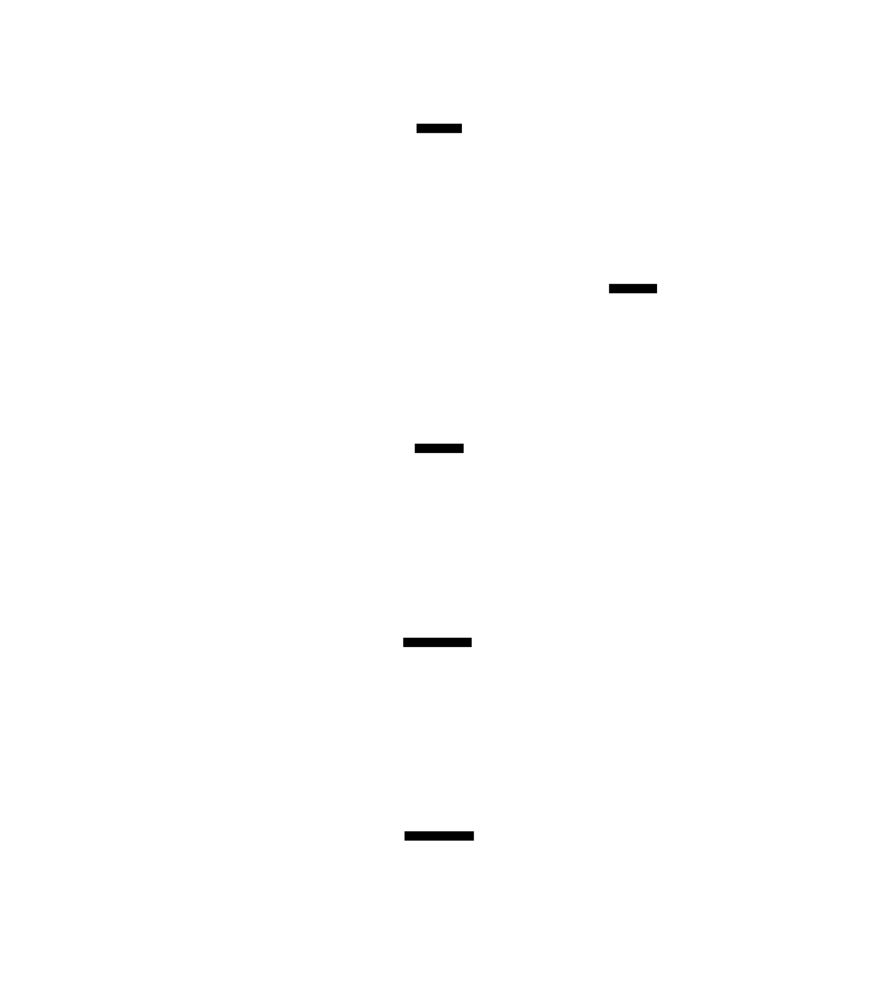

# Product overview

ProjectForge is the local control plane between a developer's project intent, provider-owned AI CLIs, and a generated repository with verification evidence.

[Edit the D2 source](forge-product-map.d2).

## Product boundary

The developer controls the brief, stack, structured options, conventions, and execution mode. Forge compiles those inputs, chooses providers per phase, keeps recovery state, and verifies the generated project.

Provider CLIs continue to own authentication, model availability, quota, billing, and their execution sandbox. Forge sends live scaffold context through those installed CLIs; it does not collect provider credentials.

The generated repository is the durable result. Its `.forge/` directory records the execution contract and verification outcome, while `~/.forge/` stores user configuration and local learning for later runs.
